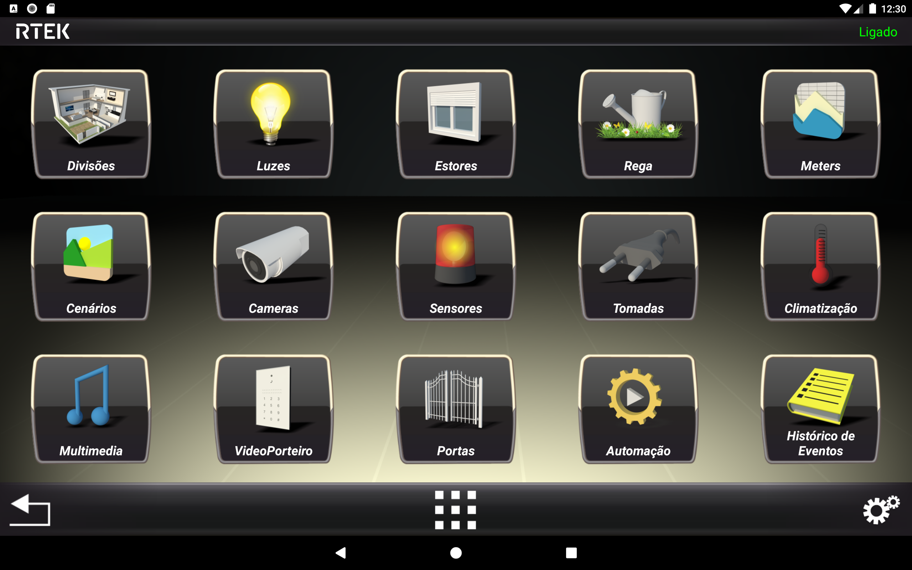

# RTEK to MQTT

_RTEK - Smart Home System [Link](https://rtek.pt/en/)_

![Supports amd64 Architecture][amd64-shield]
![Supports armv7 Architecture][armv7-shield]
![Supports armv8 Architecture][armv8-shield]
![Supports i386 Architecture][i386-shield]

[amd64-shield]: https://img.shields.io/badge/amd64-yes-green.svg
[armv7-shield]: https://img.shields.io/badge/armv7-yes-green.svg
[armv8-shield]: https://img.shields.io/badge/armv8-yes-green.svg
[i386-shield]: https://img.shields.io/badge/i386-yes-green.svg

Bridge between the RTEK Smart Home System and an MQTT server to get states and control the RTEK devices from Home Assistant with autodiscovery. Devices are automatically configured in Home Assistant by using the Mosquitto addon. 
 

## Config

- **rtekHost**, **rtekPort** (8080), **rtekUser** (admin), **rtekPassword**: RTEK server and credentials
- **mqttHost**, **mqttPort** (1883), **mqttUser** (Mosquitto), **mqttPassword**: MQTT server and credentials
  **NOTE:** To use the internal Mosquitto addon, leave the MQTT config fields empty
- **mqttBaseTopic**: topic to publish (rtek)
- **verbose**: show debug messages (0 / 1 / 2) - Default: 0
    

## Home Assistant: homeassistant/rtek/config.yaml:

Create your RTEK config file "https://raw.githubusercontent.com/apaneiro/rtek2mqtt/master/images/rtek.png"
on a new folder "rtek" in your config directoy, with the following structure: 
(You may use the File Editor addon for that purpose) 
 
#################################################### 
lights: 
#################################################### 
&nbsp;&nbsp;&nbsp;&nbsp;0x000b: 
&nbsp;&nbsp;&nbsp;&nbsp;&nbsp;&nbsp;&nbsp;&nbsp;name: Basement Front 
&nbsp;&nbsp;&nbsp;&nbsp;&nbsp;&nbsp;&nbsp;&nbsp;label: L1 
&nbsp;&nbsp;&nbsp;&nbsp;&nbsp;&nbsp;&nbsp;&nbsp;icon: wall-sconce-flat # optional 
&nbsp;&nbsp;&nbsp;&nbsp;&nbsp;&nbsp;&nbsp;&nbsp;area: Basement # optional 
 
#################################################### 
sensors: 
#################################################### 
&nbsp;&nbsp;&nbsp;&nbsp;0x00b4: 
&nbsp;&nbsp;&nbsp;&nbsp;&nbsp;&nbsp;&nbsp;&nbsp;name: Basement Motion 
&nbsp;&nbsp;&nbsp;&nbsp;&nbsp;&nbsp;&nbsp;&nbsp;label: DM1 
&nbsp;&nbsp;&nbsp;&nbsp;&nbsp;&nbsp;&nbsp;&nbsp;class: Motion 
&nbsp;&nbsp;&nbsp;&nbsp;&nbsp;&nbsp;&nbsp;&nbsp;area: Basement # optional 
 
#################################################### 
blinds: 
#################################################### 
&nbsp;&nbsp;&nbsp;&nbsp;0x008b: 
&nbsp;&nbsp;&nbsp;&nbsp;&nbsp;&nbsp;&nbsp;&nbsp;name: Basement Gate 
&nbsp;&nbsp;&nbsp;&nbsp;&nbsp;&nbsp;&nbsp;&nbsp;label: BL3 
&nbsp;&nbsp;&nbsp;&nbsp;&nbsp;&nbsp;&nbsp;&nbsp;position_open: 10000 # optional, 10000 
&nbsp;&nbsp;&nbsp;&nbsp;&nbsp;&nbsp;&nbsp;&nbsp;position_closed: 0 # optional, 0 
&nbsp;&nbsp;&nbsp;&nbsp;&nbsp;&nbsp;&nbsp;&nbsp;area: Basement # optional 
 
#################################################### 
speakers: 
#################################################### 
&nbsp;&nbsp;&nbsp;&nbsp;11540: 
&nbsp;&nbsp;&nbsp;&nbsp;&nbsp;&nbsp;&nbsp;&nbsp;name: Basement TURN OFF 
&nbsp;&nbsp;&nbsp;&nbsp;&nbsp;&nbsp;&nbsp;&nbsp;label: S11540 
&nbsp;&nbsp;&nbsp;&nbsp;&nbsp;&nbsp;&nbsp;&nbsp;subtype: turn_off 
&nbsp;&nbsp;&nbsp;&nbsp;&nbsp;&nbsp;&nbsp;&nbsp;area: Basement # optional 
&nbsp;&nbsp;&nbsp;&nbsp;11541: 
&nbsp;&nbsp;&nbsp;&nbsp;&nbsp;&nbsp;&nbsp;&nbsp;name: Basement TURN ON 
&nbsp;&nbsp;&nbsp;&nbsp;&nbsp;&nbsp;&nbsp;&nbsp;label: S11541 
&nbsp;&nbsp;&nbsp;&nbsp;&nbsp;&nbsp;&nbsp;&nbsp;subtype: turn_on 
&nbsp;&nbsp;&nbsp;&nbsp;&nbsp;&nbsp;&nbsp;&nbsp;area: Basement # optional 
 

[def]: https://github.com/apaneiro/solius_reader/blob/main/icon.png
